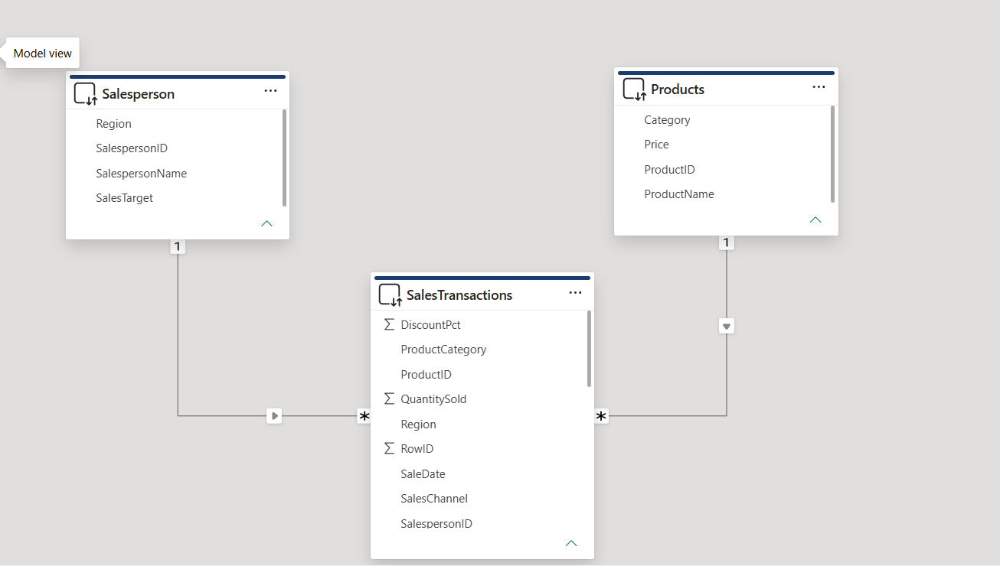

# Power BI Sales Assessment

## Overview

This repository contains my completed Power BI Sales Assessment built using **DirectQuery** mode connected to a **SQL Server** database. The report demonstrates data cleaning, data modelling, DAX measures, interactive visuals, drill-down functionality, and KPI tracking.

---

## Dataset Summary

| Table              | Rows  | Description                                                             |
| ------------------ | ----- | ----------------------------------------------------------------------- |
| Sales Transactions | 2,828 | Orders across 4 regions, 3 categories, 2 channels (Jan 2003 – Jun 2005) |
| Products           | 18    | Product names, categories, and unit prices ($22 – $1,433)               |
| Salesperson        | 50    | Salesperson details with regional sales targets ($56K – $988K)          |

**Regions:** East, North, South, West  
**Product Categories:** Clothing, Electronics, Furniture  
**Sales Channels:** Online, In-store

---

## Repository Structure

```
powerbi-sales-assessment/
│
├── README.md                        ← You are here
├── SalesAssessment_Setup.sql        ← SQL script to create DB and load all data
├── Sample_Data.xlsx                 ← Original dataset provided for assessment
│
├── SalesReport.pbip                 ← Power BI Project file (open this)
├── SalesReport.Dataset/             ← Data model: tables, measures, relationships
├── SalesReport.Report/              ← Report pages and visuals
│
├── screenshots/
│   ├── 01_data_model.png            ← Relationships view in Power BI
│   ├── 02_basic_report.png          ← Sales & Discount by Region/Category/Channel
│   ├── 03_drilldown_report.png      ← Drill-down: Region → Category → Salesperson
│   └── 04_kpi_card.png              ← KPI card: Sales vs Target by Region
│
└── docs/
    └── answers.md                   ← Full answers to all assessment questions
```

---

## How to Run This Project

### Prerequisites

- [Power BI Desktop](https://powerbi.microsoft.com/desktop/) (latest version)
- [SQL Server Express](https://www.microsoft.com/en-us/sql-server/sql-server-downloads) (free)
- [SQL Server Management Studio – SSMS](https://learn.microsoft.com/en-us/sql/ssms/download-sql-server-management-studio-ssms) (free)

---

### Step 1 — Set Up the Database

1. Open **SSMS** and connect to `localhost\SQLEXPRESS`
2. Open the file `SalesAssessment_Setup.sql`
3. Click **Execute (F5)**

This script will automatically:

- Create the `SalesAssessment` database
- Create 3 tables with correct data types and foreign keys
- Insert all cleaned data (2,828 sales rows, 18 products, 50 salespersons)
- Run verification queries to confirm row counts

---

### Step 2 — Enable .pbip Format in Power BI Desktop

1. Go to **File → Options & Settings → Options**
2. Click **Preview Features**
3. Enable **"Power BI Project (.pbip)"**
4. Restart Power BI Desktop

---

### Step 3 — Open the Report

1. Open **`SalesReport.pbip`** in Power BI Desktop
2. Go to **Home → Transform Data → Data Source Settings**
3. Update the server to `localhost\SQLEXPRESS` and database to `SalesAssessment`
4. Click **Close & Apply**

> **Note:** The report uses two Power Query **parameters** (`ServerName` and `DatabaseName`) to manage the connection. Update these under **Home → Transform Data → Manage Parameters** if your server name differs.

---

### Step 4 — Explore the Report Pages

| Page                        | Description                                                                   |
| --------------------------- | ----------------------------------------------------------------------------- |
| **Page 1 – Sales Overview** | Total Sales and Total Discount by Region, Product Category, and Sales Channel |
| **Page 2 – Drill-Down**     | Interactive drill-down from Region → Product Category → Salesperson           |
| **Page 3 – KPI Targets**    | KPI card comparing Total Sales vs Sales Target per Region                     |

---

## Data Model

The report follows a **Star Schema**:

```
Products (1)  ──────────────────── (Many) SalesTransactions (Many) ──── (1) Salesperson
[ProductID]   One-to-Many                  [ProductID]                       [SalespersonID]
                                           [SalespersonID]
```

Both relationships are **One-to-Many** with single cross-filter direction for optimal DirectQuery performance.

---

## Power Query Parameters

The data source connection is managed via two parameters, making it easy to switch environments without editing each table query individually:

| Parameter      | Default Value        | Purpose                  |
| -------------- | -------------------- | ------------------------ |
| `ServerName`   | `GRIM_PC\SQLEXPRESS` | SQL Server instance name |
| `DatabaseName` | `SalesAssessment`    | Target database name     |

To switch to a different server or database: **Home → Transform Data → Manage Parameters**

---

## Data Cleaning (SQL Layer)

All cleaning is applied **inside the Power Query native SQL queries** — the source tables in SQL Server are left completely untouched. Each table query includes defensive SQL that handles current and future data quality issues automatically:

### Products

- Filters out null or blank `ProductID`, `ProductName`, `Category`
- Excludes zero or negative prices (`Price > 0`)
- Trims whitespace from all text columns

### Salesperson

- Filters out null or blank IDs, names, and regions
- Validates `Region` against a fixed list: `('North', 'South', 'East', 'West')`
- Excludes negative sales targets

### SalesTransactions

- Excludes future-dated transactions (`SaleDate <= GETDATE()`)
- Auto-heals `'Unknown'` or blank `ProductCategory` by looking up from Products table (falls back to `'Uncategorized'`)
- Auto-heals `'Unknown'` or blank `Region` by looking up from Salesperson table (falls back to `'Unassigned'`)
- Validates `SalesChannel` against `('Online', 'In-store')`
- Excludes zero or negative quantities
- Clamps `DiscountPct` to valid range: values below 0 set to 0, values above 100 set to 100
- Trims whitespace from all text columns

---

## DAX Measures

Measures are organised into three display folders:

### Sales Metrics

| Measure                 | Formula                                                                      | Purpose                                  |
| ----------------------- | ---------------------------------------------------------------------------- | ---------------------------------------- |
| `Total Sales`           | `SUMX(SalesTransactions, QuantitySold * RELATED(Price))`                     | Primary revenue metric (before discount) |
| `Gross Sales`           | Same as Total Sales                                                          | Alternate label for gross revenue        |
| `Total Discount Amount` | `SUMX(SalesTransactions, QuantitySold * RELATED(Price) * DiscountPct / 100)` | Total discount given                     |
| `Net Sales`             | `Total Sales - Total Discount Amount`                                        | Revenue after discount                   |
| `Total Quantity Sold`   | `SUM(QuantitySold)`                                                          | Total units sold                         |
| `Avg Discount %`        | `AVERAGE(DiscountPct)`                                                       | Average discount rate                    |

### Drill-Down Metrics

| Measure                | Purpose                                       |
| ---------------------- | --------------------------------------------- |
| `Sales by Region`      | Total Sales scoped to Region level            |
| `Sales by Category`    | Total Sales scoped to Region + Category level |
| `Sales by Salesperson` | Total Sales scoped to all 3 drill levels      |
| `Sales % of Total`     | Contribution % vs grand total                 |
| `Sales % of Region`    | Contribution % vs parent region               |

### KPI Metrics

| Measure                | Purpose                                                                                 |
| ---------------------- | --------------------------------------------------------------------------------------- |
| `Sales Target`         | Target aggregated from Salesperson table, filtered by region context via `TREATAS`      |
| `Sales vs Target`      | Absolute variance (Total Sales − Target)                                                |
| `Sales vs Target %`    | Variance % against target                                                               |
| `Target Achievement %` | Total Sales ÷ Sales Target                                                              |
| `KPI Status`           | `1` = Above target, `0` = Within 10% below, `-1` = More than 10% below                  |
| `KPI Color`            | Returns hex color string for conditional formatting (`#27AE60` / `#F39C12` / `#E74C3C`) |

---

## Why DirectQuery?

This report uses **DirectQuery** rather than Import mode so that:

- Every visual sends a live query to SQL Server
- The report always reflects the most current data
- No data snapshot is stored inside the .pbix/.pbip file

---

## Why .pbip Format?

This project is saved in **Power BI Project (.pbip)** format instead of .pbix because:

- Every table, measure, relationship, and visual is stored as a **readable text file**
- Git tracks **line-by-line changes** (e.g. a DAX measure edit shows exactly what changed)
- The recruiter can browse the entire data model and report structure directly on GitHub

---

## Screenshots

### Data Model



---

## Full Q&A

All assessment questions are answered in detail in [`docs/answers.md`](docs/answers.md)

---

## Author

Submitted as part of the Power BI Developer role assessment.
